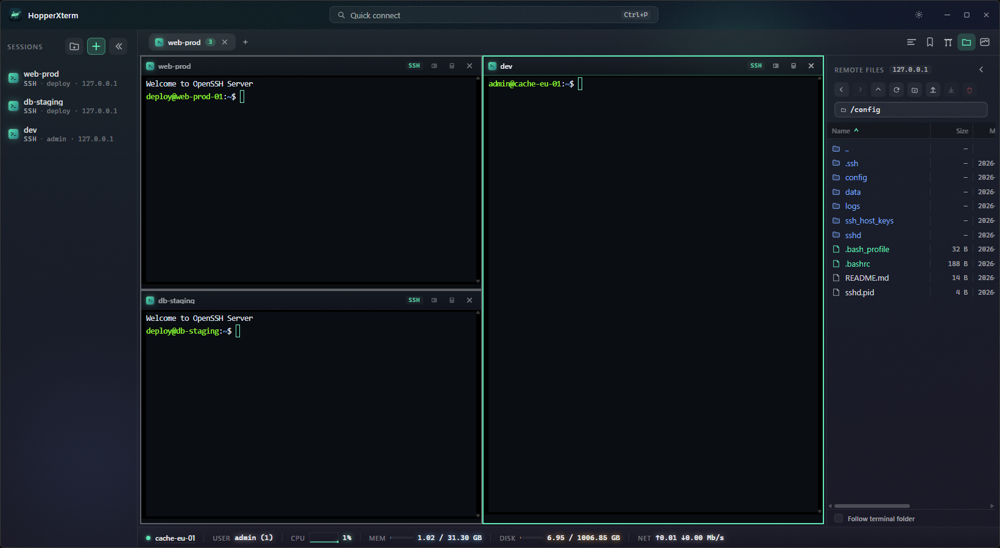

# HopperXterm

A fast, cross-platform SSH/SFTP terminal GUI client for Windows, macOS, and Linux.



---

## Features

- **Many transports in one client** — SSH, local shell, and WSL terminals, plus
  file-oriented sessions for SFTP, SCP, FTP, AWS S3, and AWS EC2 (instance
  discovery → SSH).
- **Split-tree multi-pane tabs** — up to 6 panes per tab in an arbitrarily
  nested horizontal/vertical split layout, with drag-to-merge, per-tab
  synchronized input, and an F11 full-screen "zen" mode.
- **Remote file browsers** — a slim right-side *Remote Files* panel and a full
  dual-pane *Local │ Remote* browser, both with multi-select, sortable/resizable
  columns, drag-and-drop upload, recursive directory transfer, and live
  transfer progress with cancel.
- **Resource monitor** — one persistent 1 Hz exec channel per host feeds CPU /
  memory / disk / network metrics to a status-bar strip and a multi-window
  graph panel, with native pollers for Linux, macOS, and Windows.
- **Connection resilience** — 5 s SSH keepalive with fast Suspect/Disconnected
  detection, TOFU host-key pinning with a mid-handshake prompt on key changes,
  and in-app reconnect.
- **Workflow tools** — a fuzzy command palette (Ctrl/⌘ P), saved workspaces
  (named tab layouts), recorded/replayed keystroke macros, run-on-connect
  commands, a recent-sessions menu, and one-click *copy SSH command*.
- **Customizable terminal** — xterm.js with WebGL rendering, a scrollback search
  overlay, font/zoom controls, and opt-in custom key bindings scoped per shell
  kind (ssh-windows / ssh-linux / ssh-macos / local / WSL).
- **Portable configuration** — sessions, groups, workspaces, macros, and
  preferences export and import as a single zip; passwords stay in the OS
  keychain and are never included.
- **Native-feeling chrome** — a frameless window with fully custom title-bar
  controls on Windows and Linux, a native titled window with traffic lights on
  macOS, and compositing tuned for smooth scrolling inside the WebView.
- **Credentials in the OS keychain** — passwords are stored per-session via the
  platform keychain (Windows Credential Manager, macOS Keychain, libsecret on
  Linux), never in plaintext config, and never exported.

## Tech stack

- **Backend:** Go 1.25+ with [Wails v2](https://wails.io)
  (`golang.org/x/crypto/ssh`, `github.com/pkg/sftp`,
  `github.com/zalando/go-keyring`)
- **Frontend:** React 18 + TypeScript in the OS WebView, built with Vite,
  state via Zustand, styling via Tailwind
- **Terminal:** [xterm.js](https://xtermjs.org) with the fit, WebGL, and search
  addons
- **Config & secrets:** JSON records under the OS config dir; secrets in the OS
  keychain

## Prerequisites

- [Go](https://go.dev/dl/) 1.25 or newer
- [Node.js](https://nodejs.org) 18+ and npm
- [Wails CLI v2](https://wails.io/docs/gettingstarted/installation):
  `go install github.com/wailsapp/wails/v2/cmd/wails@latest`
- Platform WebView runtime (WebView2 on Windows; WebKit on macOS/Linux)

Run `wails doctor` from `app/` to verify your toolchain.

## Build & run

All commands run from the `app/` directory. Release builds are collected into a
per-platform subfolder: `app/build/bin/win/` for Windows, `app/build/bin/mac/`
for macOS, and `app/build/bin/linux/` for Linux.

### Develop (any platform)

| Command | What it does |
| --- | --- |
| `wails dev` | Hot-reload dev server (Go backend + Vite frontend), opens the native window |
| `wails build` | Production binary in the `app/build/bin` root — the raw Wails output before the scripts collect it |
| `go build .` | Fast Go-side compile check |
| `cd frontend && npm run build` | Frontend-only build |

### Windows builds

Run from PowerShell (each script has a `.cmd` twin that ignores execution policy).

| Command | What it does |
| --- | --- |
| `scripts\build_win.ps1` | Local build (x64): runnable binary → `app/build/bin/win/HopperXterm.exe` (`-Run` to launch it) |
| `scripts\build_win_installer.ps1` | Release (x64): NSIS installer → `app/build/bin/win/HopperXterm-amd64-installer.exe` (requires NSIS) |

### macOS builds

Run on the Mac (the build self-provisions its Go/Node/Wails toolchain on first run).

| Command | What it does |
| --- | --- |
| `scripts/build_mac.sh` | Local build: universal `.app` → `app/build/bin/mac/HopperXterm.app` (ad-hoc signed) |
| `scripts/build_mac_installer.sh` | Release: drag-to-Applications DMG → `app/build/bin/mac/HopperXterm-<ver>-macos-universal.dmg` |

### Linux builds

Run on the Linux box (the build self-provisions its Go/Node/Wails toolchain on
first run, and installs the system gtk3 + webkit2gtk **dev** packages — that
step needs sudo). On distros that ship only webkit2gtk-4.1 (Ubuntu 24.04+,
etc.) the `-tags webkit2_41` build tag is added automatically.

To install the system build dependencies yourself (Debian / Ubuntu):

```sh
sudo apt-get install build-essential pkg-config libgtk-3-dev libwebkit2gtk-4.1-dev
```

On other distros: `dnf install gcc pkg-config gtk3-devel webkit2gtk4.1-devel`
(Fedora), `pacman -S base-devel pkgconf gtk3 webkit2gtk-4.1` (Arch), or
`zypper install gcc pkg-config gtk3-devel webkit2gtk4.1-devel` (openSUSE).
Substitute the `4.0`/`3` package variant if your distro doesn't have 4.1.

| Command | What it does |
| --- | --- |
| `scripts/build_linux.sh` | Local build: binary → `app/build/bin/linux/HopperXterm` |
| `scripts/build_linux_installer.sh` | Release: AppImage → `app/build/bin/linux/HopperXterm-<ver>-linux-<arch>.AppImage` |

The AppImage bundles only the binary, not gtk3/webkit2gtk — those must be
present on the target machine.

## Testing

- **Go:** `go test ./...` — runs against an in-process SSH/SFTP harness, so no
  live remote host is required.
- **Frontend:** `cd frontend && npm test` (or `npm run test:coverage` for the
  coverage report) — Vitest in a jsdom environment.

## License

Released under the [MIT License](LICENSE). 
